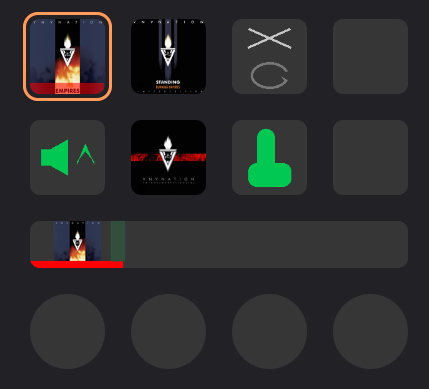
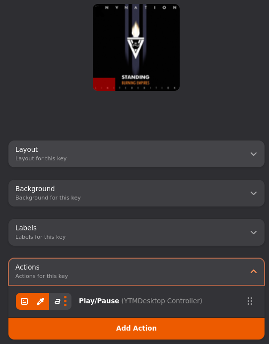
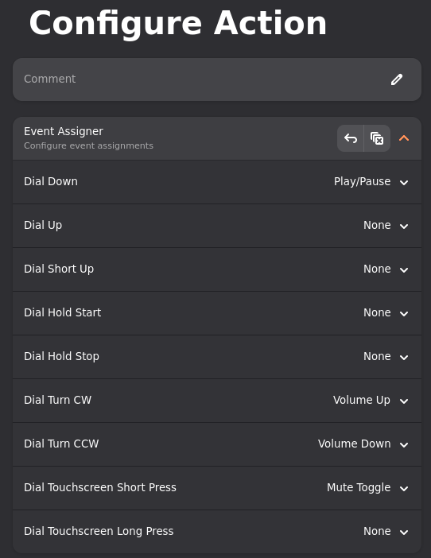
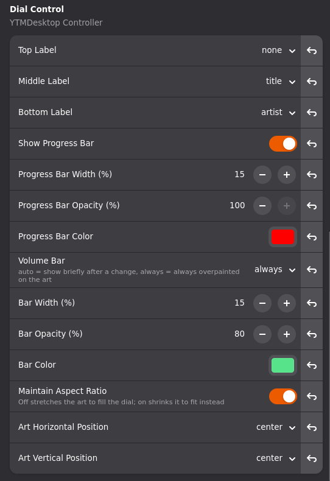

# YTMDesktop Controller

A StreamController plugin for controlling [YouTube Music Desktop](https://github.com/ytmdesktop/ytmdesktop) (YTMD) from a Stream Deck, via YTMD's own Companion Server API.



## Connecting to YTMD

Every action below shares one connection, configured once in the plugin's own settings.

1. In **YTMD**: Settings → Integration → enable **Companion Server**, and turn on **Authorized companions**.
2. In **StreamController**: open this plugin's settings (Plugins → YTMDesktop Controller → the settings/gear icon).
3. Set **Host** / **Port** if YTMD isn't running on `localhost:9863`.
4. Optionally change **Client Identifier** — it defaults to your machine's hostname. YTMD's own "authorized companions" list is keyed on this value, so if you run this plugin from more than one machine (or want to re-pair cleanly), give each one a distinct identifier.
5. Click **Pair with YTMD** and confirm the prompt in YTMD right away — the pairing code is only valid for about a minute.
6. The status changes to **Paired** once confirmed.

That's the only setup step. Every action communicates through this single paired connection.

## Thumbnail cache

Album art (and other track art, like Track Step's upcoming-track preview) is cached to disk under the plugin's own folder, so returning to a recently-seen track doesn't re-download its artwork. The same settings screen as above shows:

- **Cached Thumbnails** — how many images are cached and how much disk space they use.
- **Purge Thumbnail Cache** — deletes every cached thumbnail. They're simply re-downloaded from YTMD the next time they're needed.
- **Max Cached Thumbnails** — how many images to keep (oldest evicted first); defaults to 30. Changes apply immediately, no restart needed.

## The actions

| Action | Input | What it does |
|---|---|---|
| **Play/Pause** | Key | Shows the current track's art and, optionally, title/artist labels and a progress bar. Press to toggle playback. |
| **Track Step** | Key | Skip forward/back. Optionally previews the *upcoming* or *previous* track's art/title instead of the current one. |
| **Volume Control** | Key | Nudge the volume up/down by a configurable amount, or jump straight to a set level. |
| **Dial Control** | Dial | An all-in-one dial: album art, an optional volume bar and progress bar, optional title/artist labels, and every function (play/pause, mute, next/previous, volume) bindable to any gesture. |
| **Shuffle & Repeat** | Key | Toggle shuffle and control repeat mode, with a status icon. |
| **Thumbs Up/Down** | Key | Like/dislike the current track, with a status icon. |

Add any of these the normal StreamController way — drag an empty key or dial's **Add Action** button, pick it from *YTMDesktop Controller*, then configure it in the sidebar.



## The Event Assigner

Every action except Play/Pause exposes more than one function (e.g. Volume Control has *Volume Up* and *Volume Down*), and lets you decide which physical gesture triggers which one, instead of hard-coding one function per key. This is StreamController's own **Event Assigner** panel, in each action's configuration:



- The **left column** is the fixed physical gesture for that input (Key Down/Up/Short Up/Hold Start/Hold Stop for keys; those plus Turn CW/CCW and two touchscreen presses for dials). This list never changes.
- The **right column** is a dropdown of every function *that action* registers. Pick which function fires for each gesture, or leave it **None**.
- Every action below ships with sensible defaults already assigned — you only need to open this panel if you want to remap something (e.g. swap which gesture triggers Next vs. Previous), or to bind a function that has no default (like Dial Control's *Repeat On/Single/Off*, or Shuffle & Repeat's individual repeat-mode functions).
- Because gestures and functions are independent, one physical key or dial can do multiple things — short press for one function, hold for another, and so on.

## Per-action reference

### Play/Pause

The only action here *without* an Event Assigner — it just toggles play/pause on press. Everything else is display configuration:

| Setting | Values | Default |
|---|---|---|
| Top / Middle / Bottom Label | `none`, `title`, `artist` | `title` / `artist` / `none` |
| Show Progress Bar | on/off | off |
| Progress Bar Width (%) | 5–50 | 15 |
| Progress Bar Opacity (%) | 10–100 | 100 |
| Progress Bar Color | color picker | red |

While paused, the art is dimmed with a pause icon overlaid - shared with Dial Control's pause status, so both always agree.

### Track Step

| Function | Default gesture |
|---|---|
| Next Track | Key Down |
| Previous Track | Key Hold Start |

| Setting | Values | Default |
|---|---|---|
| Thumbnail Preview | `none`, `next`, `previous` | `none` |
| Top / Middle / Bottom Label | `none`, `title`, `artist` | `none` / `none` / `title` |

With Thumbnail Preview set, the key shows the art of the *adjacent* track from YTMD's queue instead of the currently-playing one — handy for a "here's what's coming up next" key. The labels follow whichever track is being shown (adjacent track while previewing, current track otherwise).

### Volume Control

| Function | Default gesture |
|---|---|
| Volume Up | Key Down |
| Volume Down | Key Hold Start |
| Mute Toggle | *(no default)* |
| Set Volume | *(no default)* |

| Setting | Values | Default |
|---|---|---|
| Step | 1–100 | 10 |
| Icon Display | `both`, `up`, `down`, `none` | `both` |
| Set Volume Level | 0–100 | 50 |

The current volume is also shown as a `NN%` label (or `Muted`, if muted from Dial Control or elsewhere - volume and mute status are shared across every action in this plugin, so they always agree). Set Icon Display to `up` or `down` (and remap the Event Assigner if you want) to make a pair of dedicated volume-up / volume-down keys instead of one key that does both, or `none` to drop the icon entirely and show only the volume label.

**Set Volume** jumps straight to *Set Volume Level* when fired (bounded to the 0–100 range YTMD accepts). The *Set Volume Level* setting only appears once you've bound **Set Volume** to a gesture in the Event Assigner — bind it, and the row shows up; unbind it, and it hides again.

> This action was called **Volume Step** before v1.0.0. If you had one placed on a key from an earlier version it will show as a missing action after updating — remove it and add **Volume Control** in its place.

### Dial Control

The most configurable action — a full now-playing display with every function bindable to any dial gesture.

| Function | Default gesture |
|---|---|
| Play/Pause | Dial Short Up |
| Mute Toggle | Dial Touchscreen Short Press |
| Next Track | *(no default)* |
| Previous Track | *(no default)* |
| Volume Up | Dial Turn CW |
| Volume Down | Dial Turn CCW |
| Like | *(no default)* |
| Dislike | *(no default)* |
| Toggle Like | Dial Hold Start |
| Toggle Dislike | *(no default)* |

Like/Dislike only ever move you *into* that state (pressing Like when already liked does nothing). Toggle Like/Toggle Dislike are the raw toggle instead - pressing again undoes it (back to neutral). All four briefly flash a matching thumb icon (green for like, red for dislike, gray if a toggle just undid a rating) over the dial for 7 seconds.

*(Dial Up, Dial Down, Dial Hold Stop, and Dial Touchscreen Long Press have no default — bind them to whatever you like.)*



| Setting | Values | Default |
|---|---|---|
| Top / Middle / Bottom Label | `none`, `title`, `artist` | `none` / `title` / `artist` |
| Show Progress Bar | on/off | off |
| Progress Bar Width (%) | 5–50 | 15 |
| Progress Bar Opacity (%) | 10–100 | 100 |
| Progress Bar Color | color picker | red |
| Volume Bar | `auto` (briefly shows after a change), `always` | `auto` |
| Bar Width (%) | 5–75 | 25 |
| Bar Opacity (%) | 10–100 | 100 |
| Bar Color | color picker | green |
| Maintain Aspect Ratio | on/off | off (stretches art to fill) |
| Art Horizontal / Vertical Position | left/center/right, top/center/bottom | center / center |

Three things worth knowing:
- If both the progress bar and volume bar are enabled, the progress bar reserves its height off the bottom of the dial first, and the volume bar's fill range is scaled to whatever space is left above it, so they never overlap.
- Turning the dial always unmutes first (a muted knob that silently changes an inaudible volume isn't useful), and the mute icon dims the volume bar rather than showing a separate indicator.
- While paused, the whole dial is dimmed with a pause icon overlaid - shared with Play/Pause's pause status, so both always agree.

### Shuffle & Repeat

| Function | Default gesture |
|---|---|
| Toggle Shuffle | Key Down |
| Cycle Repeat (steps Off → All → One → Off) | Key Hold Start |
| Repeat On / Repeat Single / Repeat Off | *(no default — assign directly if you want one gesture per mode instead of cycling)* |

No additional settings. The key shows a static shuffle glyph (crossed lines) above a repeat-status loop icon: gray = off, green = repeat-all, green with a "1" = repeat-one.

> YTMD doesn't report whether shuffle is currently on or off, and its API only exposes a toggle — not a set-explicit-state command. Because of that, there's no reliable way to show shuffle's actual status or offer separate "Shuffle On"/"Shuffle Off" functions; the shuffle icon is always the same, and the only shuffle function is a toggle.

### Thumbs Up/Down

| Function | Default gesture |
|---|---|
| Like | Key Down |
| Dislike | Key Hold Start |
| Toggle Like | *(no default)* |
| Toggle Dislike | *(no default)* |

Like/Dislike only ever move you *into* that state (pressing Like when already liked does nothing). Toggle Like/Toggle Dislike are the raw toggle instead - pressing again undoes it (back to neutral).

| Setting | Values | Default |
|---|---|---|
| Icon Display | `both`, `up`, `down` | `both` |

Unlike shuffle, YTMD does report the current rating, so Like/Dislike are true "set to this state" functions (pressing Like when already liked does nothing, rather than un-liking it), and the icon reflects the real rating: gray = neutral, green thumb = liked, red thumb = disliked. Set Icon Display to `up` or `down` to use this action as a dedicated like-only or dislike-only key.

## Customizing icons and colors

Every icon this plugin draws (shuffle, repeat, thumbs up/down, volume up/down, pause) defaults to Google's [Material Icons](https://github.com/google/material-design-icons) (Apache License 2.0, bundled as SVGs under `assets/icons/material/` — see `assets/icons/material/NOTICE.md` for attribution), but both the shape and the color are independently customizable through StreamController's own **Assets** and **Colors** tabs in this plugin's settings dialog (next to the **Settings** tab covered above):

- **Assets** — replace any icon's shape with your own image file.
- **Colors** — repick the color each icon is tinted with (e.g. the "liked" green, the "disliked" red, repeat-on/off, the pause overlay's dim and icon color).

Whichever shape you pick is always recolored using the matching color at render time (the same way the bundled defaults are) — so a custom icon works the same as the default, just with a different silhouette.

## Performance

This plugin does very little work of its own. It keeps one shared copy of YTMD's state, and when that state changes (a few times a second while a track plays) each placed action redraws only if something it actually displays changed. Measured against a live YTMD, the plugin's state handling costs roughly **0.2% of one CPU core** during playback.

If StreamController itself is using noticeable CPU, that is almost always the **deck render loop**, not this plugin. Two things drive it:

- **Animated page content.** A video or animated-GIF background (or key image) makes StreamController redraw the deck at full frame rate (~30 FPS). While that loop runs it re-rasterizes the **text of every label on every key** each frame — there is no glyph cache. A page with no animated content drops to ~2 FPS and this cost nearly disappears.
- **Label and progress-bar count.** The per-frame redraw scales with how many labels are on screen, not how often they change. Each action here can show up to three labels; enabling the progress bar adds a full-key recomposite whenever its fill moves by a pixel (a few times a second, per key).

To keep CPU down: prefer a plain-colour or static-image page background over an animated one, switch off labels you don't need, and leave the progress bar off unless you want it.

### Built-in profiler

Set the environment variable `YTMD_PROFILE=1` before starting StreamController and the plugin logs a summary every 10 seconds (`YTMD_PROFILE_INTERVAL` changes the interval). Lines are tagged `[ytmd-profile]` in StreamController's log (`<data>/logs/logs.log`):

```
[ytmd-profile] last 10s:
  state_update.recv: 39 (3.9/s)     — YTMD state-updates received from the backend
  dispatch: 273 (27.3/s)            — action callbacks run (updates × placed actions)
  on_ytmd_state: 273 calls, 23.7ms total (mean 0.09ms, max 11.30ms) = 0.2% of one core
  ui_push: 57 (5.7/s)               — image / label pushes to the deck
```

For a Flatpak install: `flatpak run --env=YTMD_PROFILE=1 com.core447.StreamController`.

With the variable unset it does nothing — no background thread, no measurable overhead. For a full picture of where StreamController's CPU goes (this plugin and the core together), attach [`py-spy`](https://github.com/benfred/py-spy): `py-spy top --pid $(pgrep -f main.py)`.
